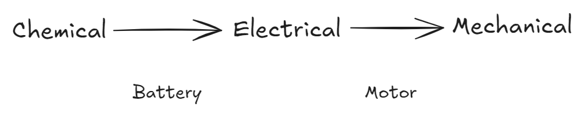
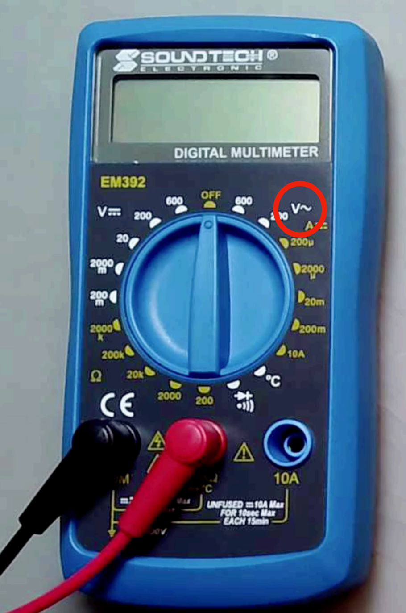
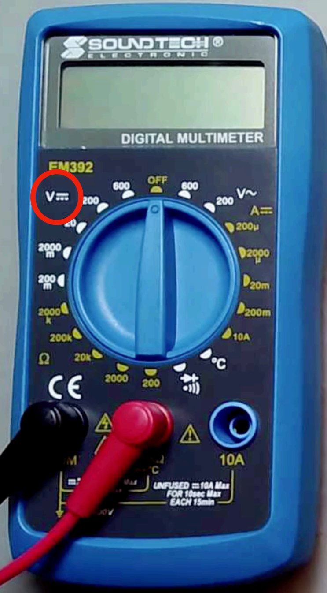

# Electricity

## Energy

Chemical -> Electrical -> Mechanical

<figure><picture><source srcset="../../.gitbook/assets/energy-dark.png" media="(prefers-color-scheme: dark)"></picture><figcaption>
Energy
</figcaption></figure>

## Mechanics

### Newton's 2nd Law

$$
F=\frac{d(mv)}{dt}=ma
$$

### Work Energy

$$
W=\int_{ds \in C}F \cdot ds=F \cdot s
$$

### Power

$$
P=\frac{dW}{dt}=\frac{W}{t}=F\cdot v ~~or~~ \tau\cdot \omega
$$

where $$\tau$$ is the **torque** and $$\omega$$ is the **angular velocity**.

## Electricity

### Ohm's Law

$$
V=IR
$$

### Power

$$
P=VI=(\frac{W}{Q})\cdot (\frac{Q}{t})
$$

Where $$\frac{W}{Q}$$ is the definition of **voltage** and $$\frac{Q}{t}$$ is the definition of **current**.

## Multimeter

### Voltage Measurement

* $$V\sim$$ is to measure **AC** voltage.

<figure><figcaption>
Multimeter AC measurement
</figcaption></figure>

* and the below icon is to measure **DC** voltage

<figure><figcaption>
Multimeter DC measurement
</figcaption></figure>

## Tips

1. Will we be given a breadboard and ask how to connect them to measure the current or voltage?
