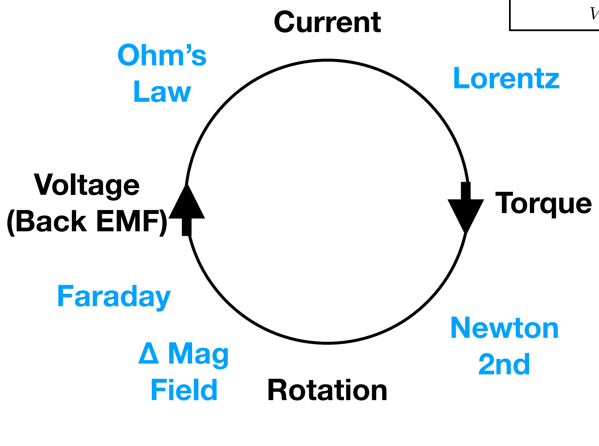
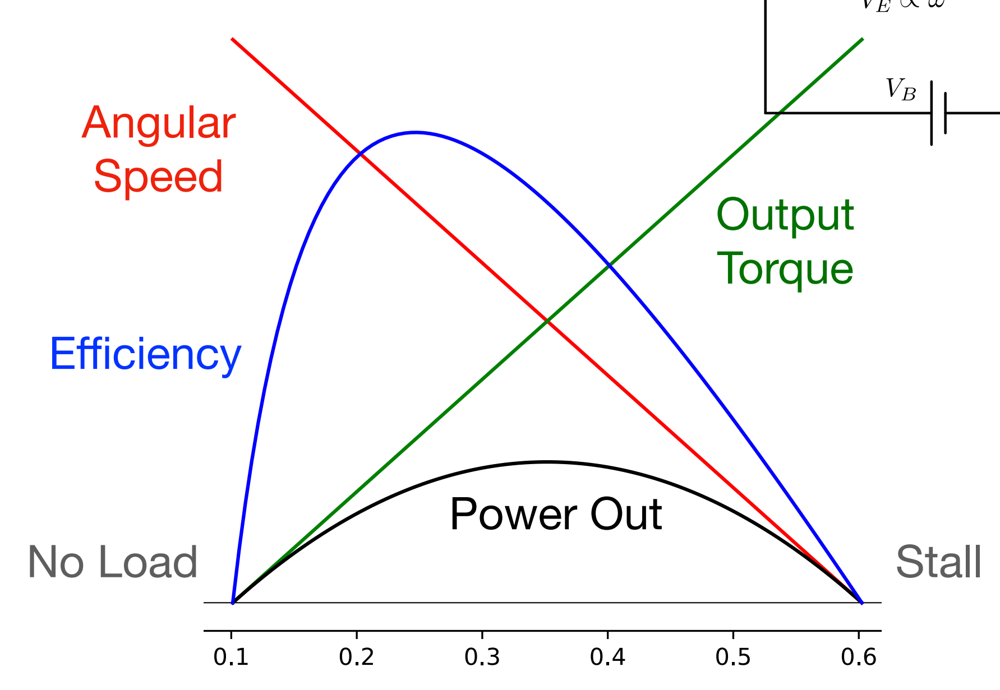

# Motor Physics

## Lorentz Force

Current in magnetic field creates a force

$$
F=i \int_{W} dl \times B=I\times B
$$

In DC Motors, our **torque** $$\tau \propto I$$.

## Faraday's Law

$$
\oint_{\partial \Sigma} E \cdot dl=-\frac{d}{dt} \iint_{\Sigma}B \cdot dA
$$

### Back EMF

$$
V_E=-\frac{d}{dt} \Phi_B
$$

The Back EMF $$V_E \propto \omega$$, where $$\omega$$ is the **angularity speed**.

## Important Relationship in DC Motors

<figure><figcaption>
An important relationship existing in DC Motors
</figcaption></figure>

## Analysis

<figure><figcaption>
Analysis
</figcaption></figure>

When a motor stalls[^1], its current draw is: **Maximum**.

Why?

As you can see, when motor stalls, the output torque is very very large and reaches the maximum. Since $$\tau \propto I$$, we can say that our current draw is **maximum.**

[^1]: A "motor stall" occurs when a motor stops rotating or running, even though it is still being supplied with power.
