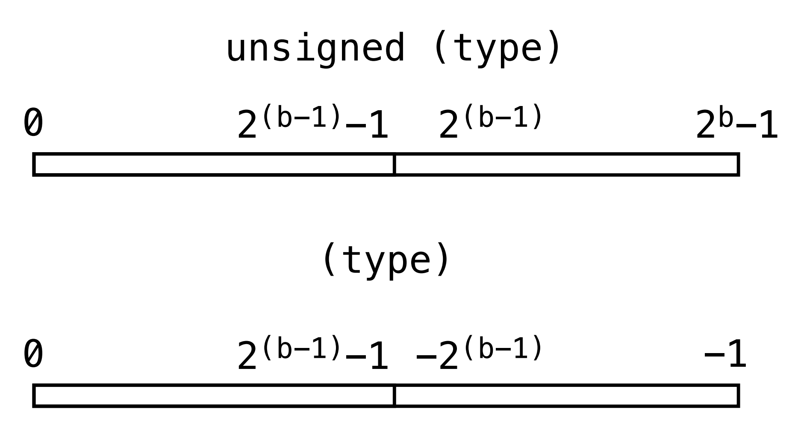

# Digital Computers

## Binary

### Characteristics

* Only consists of 1 and 2.
* Most significant bit (MSB) is on left.
* 1 byte = 8 bits

### Machine code (Assembly) Instruction Set

1. Data Transfer (read and write memory)
2. Data Manipulation (change memory)
3. Program Flow (change next execution)

## Programming Language: C

### Variables & Types

**Variable** is text names for addresses in memory. **Type** is organization and size of memory. Below are some examples of the space occupied by different types in C.

| Type          | Spaec occupied |
| ------------- | -------------- |
| char          | 8 bits         |
| int           | 16 bits        |
| unsigned long | 32 bits        |
| float         | 32 bits        |


Note that `int` type is **signed** in C!!! So, if we try to assign `32768` to an `int` variable, the variable will store `-32768` instead.


In C, **signed type** using 2's complement form to store the numbers. So, even if two types use the same number of bits, the number range they represent are different**.**

<figure><figcaption><p>unsigned vs signed</p></figcaption></figure>

In the example below, since `char` is a **signed** type and it is **8** bits long. If we assign 128 to it, in binary, it will be `10000000`. As we have discussed before, `signed` type means it will use 2's complement form to store its number. In 2's complement representation, `10000000` is `-128`. So, the value in `f` will be `-128`.

```c
int e = 128;
char f = e; // f = -128
```

### Operators

The following table contains operators that manipulate one or two numbers

| Operator name                               | Operator                  |
| ------------------------------------------- | ------------------------- |
| Arithmetic                                  | + - \* /                  |
| Comparison                                  | ==   !=   <   <=   >   >= |
| Logic                                       | !   &&   \|\|             |
| Bitwise (Do the evaluation on **each bit**) | &   \|   ^   \~   >>   << |


`~` represents **bitwise not**.&#x20;


## Tips

1. Include the ASCII code list in the **cheatsheet**!
