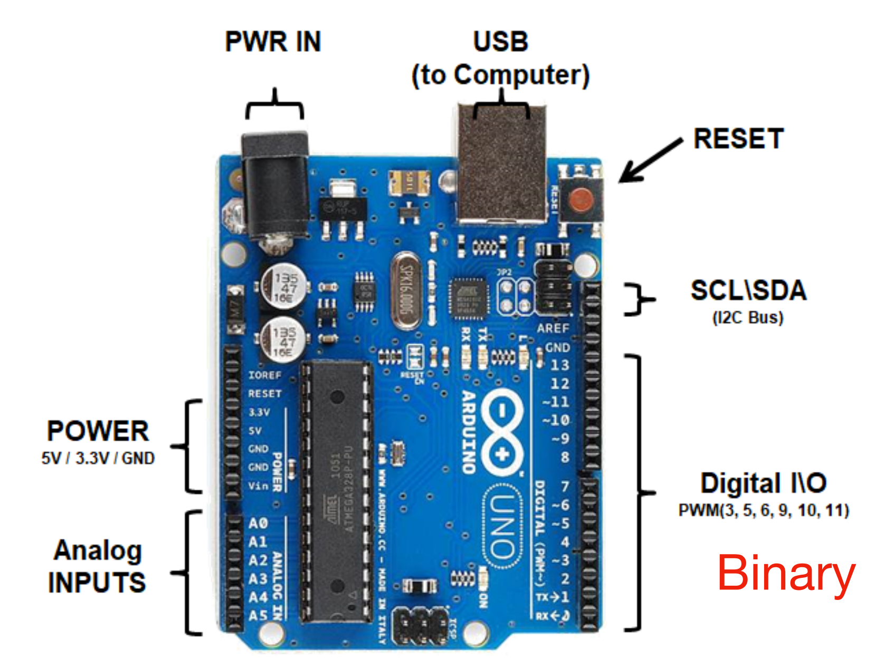

# Arduino Basics

## Hardware Anatomy

<figure><figcaption><p>Arduino Hardware Anatomy</p></figcaption></figure>

### Ports Voltage and Current

| Port Name    | Voltage and Current |
| ------------ | ------------------- |
| VIN          | 7-12V, \~1A         |
| USB Port     | 5V, \~1A            |
| Digital pins | 5V, \~40mA          |
| 5V pin       | \~800mA             |


The `~` infront of the current means the value is **approximate**.


#### Difference between Vin and 5V pin

The **Vin** pin is used to supply an external voltage to the Arduino board. Its **usage** is that you can power the Arduino by supplying an external power source (like a battery or a power adapter) to the **Vin** pin.

The **5V** pin can either be an input or an output depending on how you're powering the board.

* **Output**: When the Arduino is powered through the USB port or the Vin pin, the **5V pin** provides a regulated 5V output that can be used to power other components like sensors or modules.
* **Input**: You can also directly supply **5V** to the **5V pin** to power the Arduino, bypassing the onboard voltage regulator.

### Digital Pins

| Port Name | Purpose     |
| --------- | ----------- |
| Pins 0-1  | Serial CCOM |
| Pin 1-3   | LED pin     |
| Pin (\~)  | PWM         |

## API

### Basic Digital Input/Output (I/O)

```arduino
void pinMode(pin, OUTPUT);

void digitalWrite(pin, HIGH);

int digitalRead(pin);
```

### Timing

```arduino
void delay(millisecs);

void delayMicroseconds(microsecs);

unsigned long millis(); // overflow after around 50 days

unsigned long micros(); // overflow after around 1 hour
```

In Arudino, the `millis()` and `micros()` are built-in functions that return the number of **milliseconds/microseconds** that have passed since the Arduino board began running the current program (since the board was powered on or reset). And below is an example to blink the LED.

```arduino
const int ledPin = 13; // Pin for the LED
unsigned long previousMillis = 0; // Store the last time the LED was updated
const long interval = 1000; // Interval of 1 second (1000 ms)

void setup() {
  pinMode(ledPin, OUTPUT);
}

void loop() {
  unsigned long currentMillis = millis();

  if (currentMillis - previousMillis >= interval) {
    // Save the last time the LED was toggled
    previousMillis = currentMillis;

    // Toggle the LED state
    digitalWrite(ledPin, !digitalRead(ledPin));
  }
}
```


In Arduino, the **unit** is not set in the code.The **unit** depends on how you use the variable in your code. In the example above, we are using it with `millis()`, so its unit is **milliseconds**.


## Examples

### LED Blinking


```arduino
void setup() {
    pinMode(13, OUTPUT);
}

void loop() {
    digitalWrite(13, HIGH);
    delay(1000);
    digitalWrite(13, LOW);
    delay(1000);
}
```


In this example, we can get a glimpse of how the `delay()` function works, it actually **pauses** the execution of the program for a specified amount of time. For example, at line 7, we execute the `delay(1000)`, notice that the unit is **milliseconds**. Now the program is paused and the LED is **ON** because that after line 6, no instruction is executed, so LED will remain **ON**.
