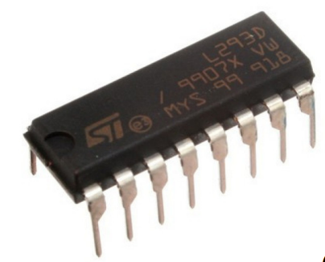

# Driver & Sensors

## Motor Driver

Still remember that in [#ports-voltage-and-current](arduino-basics.md#ports-voltage-and-current "mention") from [arduino-basics.md](arduino-basics.md "mention"), the maximum current that can be provided by the digital ports are **\~40mA**, which is not enough to drive our dc motors. So, how can we solve this problem? The answer is to use a **Motor Driver**.

### Working Pricinple

Motor Driver is basically an **electronic switch** and it **uses low power signal to control high power circuit**. And it looks like below:

<figure><figcaption><p>Motor Driver</p></figcaption></figure>

Here is a diagram for the motor driver (L293D):

<figure><figcaption><p>Motor Driver diagram</p></figcaption></figure>

| Port Name                        | Usage                                                                                                                                                                                                                                                                                                                                                                                                                                                                                |
| -------------------------------- | ------------------------------------------------------------------------------------------------------------------------------------------------------------------------------------------------------------------------------------------------------------------------------------------------------------------------------------------------------------------------------------------------------------------------------------------------------------------------------------ |
| 1,2EN and 3,4EN (**Enable Pin**) | The **EN** pin is used to enable or disable the output. When **EN** is set to a high voltage (e.g., 5V), the motor driver is enabled and ready to control the motor. When **EN** is low, the output is disabled, and no power is delivered to the motor.                                                                                                                                                                                                                             |
| 1A, 2A, 3A, 4A (**Input Pin**)   | The **A** pin receives the control signal (low or high) from the Arduino. Depending on the state of **A**, the output **Y** will either pass the power supply voltage ($$V_{CC2}$$) to the motor or ground (**0**V) the motor.                                                                                                                                                                                                                                                       |
| 1Y, 2Y, 3Y, 4Y (**Output Pin**)  | The **Y** pin outputs the voltage ($$V_{CC2}$$) to the motor if both the **EN** and **A** signals are high. Otherwise, the motor is grounded.                                                                                                                                                                                                                                                                                                                                        |
| GND                              | GND is ground. Notice that all these four grounds are **interconnected**.                                                                                                                                                                                                                                                                                                                                                                                                            |
| $$V_{CC1}$$                      | It is the **Logic Power Supply**, which is **Pin 16**. It is used to power the **logic** components of the motor driver. This voltage is what **powers the internal circuitry** that interprets the control signals from the microcontroller. In a typical setup, you would connect $$V_{CC1}$$ to the **5V** output pin on the Arduino.                                                                                                                                             |
| $$V_{CC2}$$                      | It is the **Motor Power Supply**, which is **Pin 8**. It is the power supply for the **motors** connected to the motor driver. It can be a high voltage, (**9V** or **12V**), depending on the voltage rating of the motor you're driving. This pin supplies the actual current and voltage that is passed to the motor when the driver is activated. You would connect $$V_{CC2}$$ to a separate power source capable of providing the required voltage and current for the motors. |

Now, let's take a look at the motor driver's logical operation in code

```
if ((EN == V1) && (A == V1)) {
    Y = V2;
} else {
    Y = GND;
}
```


Here, `V1` is same as $$V_{CC1}$$. `V2` is the same as $$V_{CC2}$$.


## Ultrasonic Sensor

### Code Demo


```arduino
int motor_pin = 2;
int trig_pin = 13;
int echo_pin = 12;
float sound_speed = 0.0345; // given in cm/microsec

void setup() {
    pinMode(motor_pin, OUTPUT);
    pinMode(echo_pin, INPUT);
    pinMode(trig_pin, OUTPUT);
    digitalWrite(trig_pin, LOW);
    Serial.begin(9600);
}

void loop() {
    digitalWrite(trig_pin, HIGH);
    delayMicroseconds(10);
    digitalWrite(trig_pin, HIGH);
    int microsecs = pulseIn(echo_pin, HIGH);
    float cms = microsecs * sound_speed / 2;
    Serial.println(cms);
    if (cms < 30) {
        digitalWrite(motor_pin, LOW);
    } else {
        digitalWrite(motor_pin, HIGH);
    }
}
```



Note that `pulseIn()` returns the time measured in **microseconds**.

