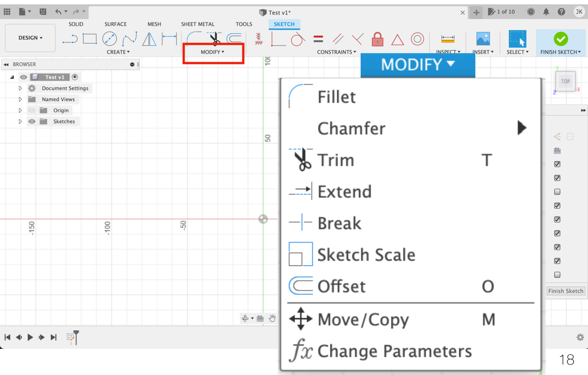
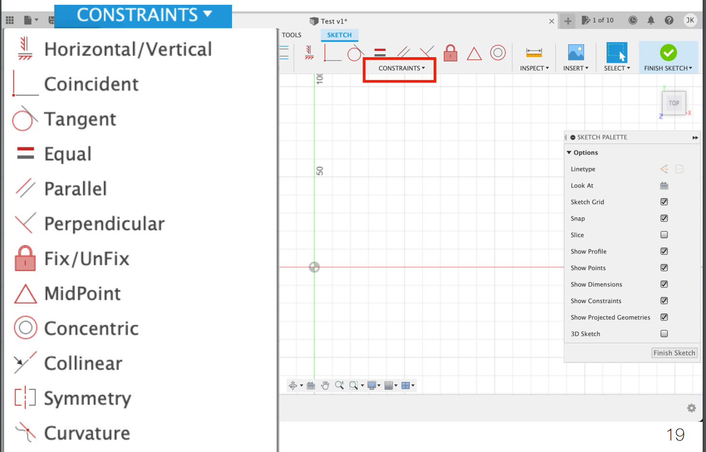

# CAD Intro

## Interface

### Modify

The "Modify" part in Fusion 360 is used to modify the 2-D sketches.

<figure><figcaption>
modify page
</figcaption></figure>

### Constraints

In Fusion 360, constraints are used in sketches to control the **geometry's behavior** and ensure accuracy. Constraints define the **relationships between different elements in a sketch**, such as **lines**, **circles**, or **arcs**, ensuring that their **positioning**, **size**, and **orientation** remain **fixed** or **follow specific rules**.

<figure><figcaption>
Constraint page
</figcaption></figure>
