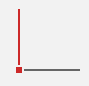
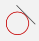
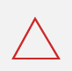
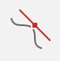
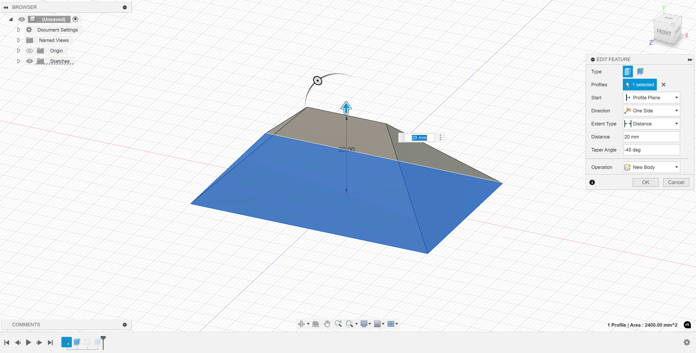

# Part Modeling I

## Constraints

The table below summarises different **constraints** and their use in 2-D plane in Fusion 360

| Name                |                                                Symbol                                                | Description                                                                                                                          |
| ------------------- | :--------------------------------------------------------------------------------------------------: | ------------------------------------------------------------------------------------------------------------------------------------ |
| Vertical/Horizontal |  | The Horizontal/Vertical constraint in Autodesk Fusion 360 forces sketch geometry to snap to the closest horizontal or vertical axis. |
| Coincident          |           | The coincident constraint fixes the position of two points or a point and a line or curve together in a sketch                       |
| Tangent             |              | The Tangent constraint forces a curve and another object to touch at a single point without crossing                                 |
| Equal               |                | The equal constraint makes two or more geometries the same size                                                                      |
| Parallel            |             | The parallel constraint is used to make two lines in a sketch parallel to each other                                                 |
| Perpendicular       |        | The perpendicular constraint forces two lines to remain at a 90-degree angle to each other                                           |
| Fix/Unfix           |            | Lock the size or location of a point or object                                                                                       |
| Midpoint            |             | Constrains a point or object to the midpoint of another object                                                                       |
| Concentric          |           | The Concentric constraint forces two or more circles, arcs, or ellipses to share a common center point.                              |
| Collinear           |                           | The Collinear constraint forces two or more objects to share a single line in a sketch                                               |
| Symmetric           |            | Constrains two or more objects so that they are symmetrical (identical to each other in relation to a common axis)                   |
| Curvature           |            | The curvature constraint creates a smooth, continuous curve between two or more objects in a sketch                                  |

## Extrude

There is a fancy function in Extrude called **taple angel**, which can control inclined angle from the base to the extrusion. As shown below,

<figure><figcaption>
Extrusion with angle
</figcaption></figure>
