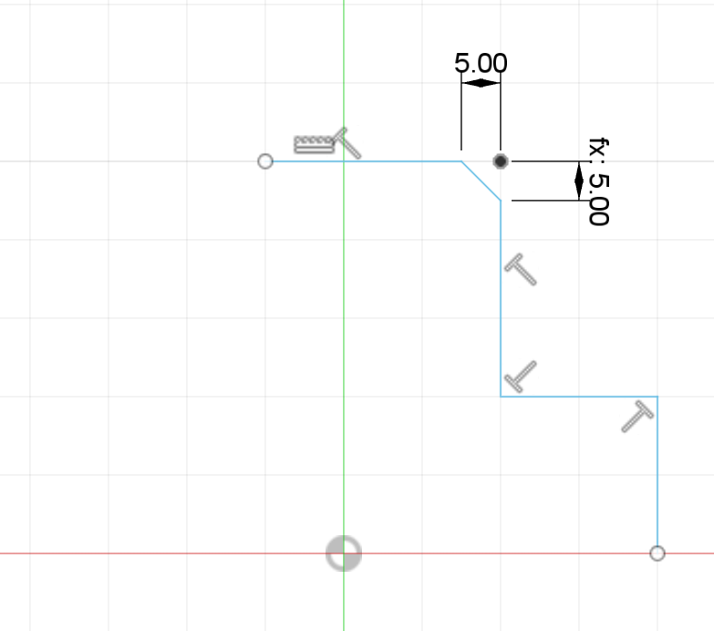
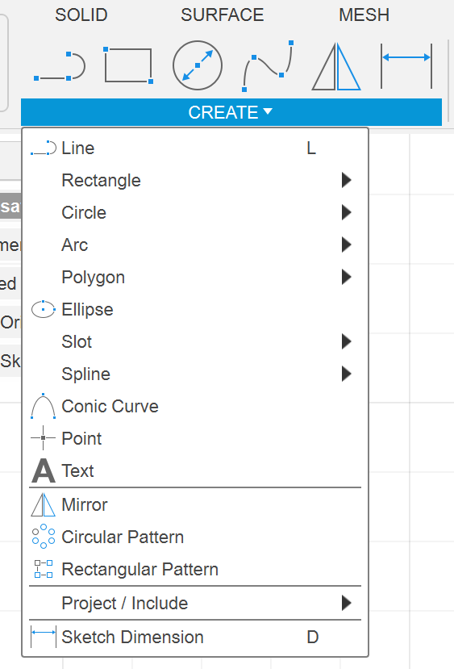
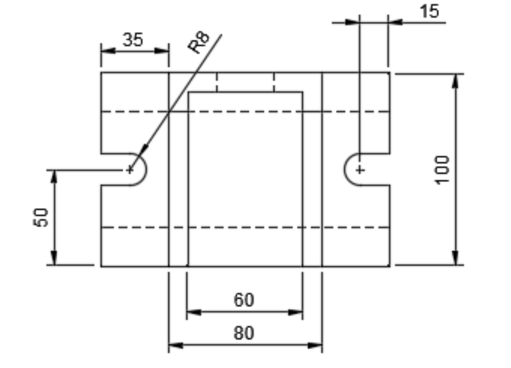
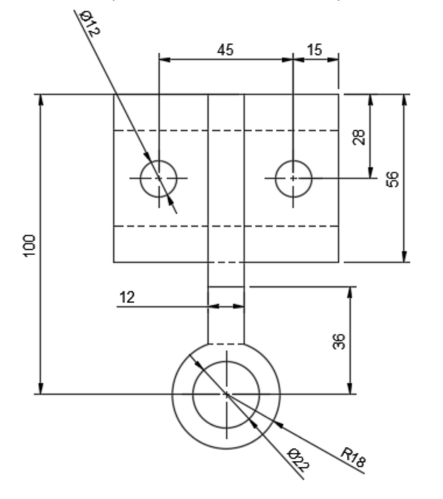

# Part Modeling II

## Fusion 360 functions

### Chamfer

**Chamfer** is a feature used to create a beveled edge between two surfaces, typically at a corner. It removes the sharp edge and replaces it with a flat or angled surface. Chamfers are commonly used in design to soften edges, reduce sharpness for safety, or prepare parts for assembly.

<figure><figcaption>
Chamfer
</figcaption></figure>

For example, in this example, we are using the **equal distance** chamfer function.

### Fillet

**Fillet** is a feature used to create a rounded edge between two surfaces, typically at a corner or along an edge. It smooths out sharp edges by adding a curve, which can improve the appearance, reduce stress concentration, or make parts safer to handle.

### Arc

The **arc function** in Fusion 360 is a tool used to create curved lines or sections of circles in sketches, essential for designing rounded shapes or connecting elements with smooth curves. It is located under the "Create" column.

<figure><figcaption>
Location of Arc
</figcaption></figure>

For example, if you want the **half circle** in the draft below, you can use the **arc** function to create one.

<figure><figcaption>
Example for arc
</figcaption></figure>

## 2-D Sketch

### Radius and Diameter

In Fusion 360, the **radius** in the sketch begins with **R** while the **diameter** begins with $$\phi$$.

<figure><figcaption>
Radius and Diameter Example
</figcaption></figure>
