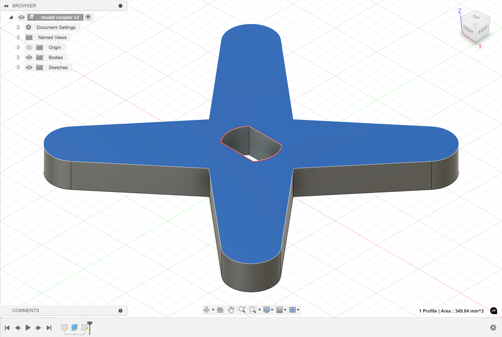
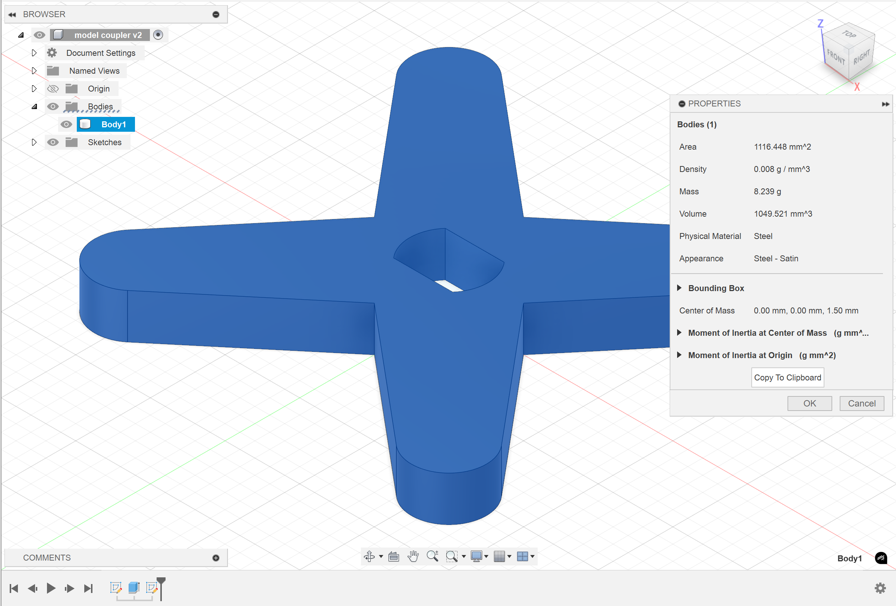
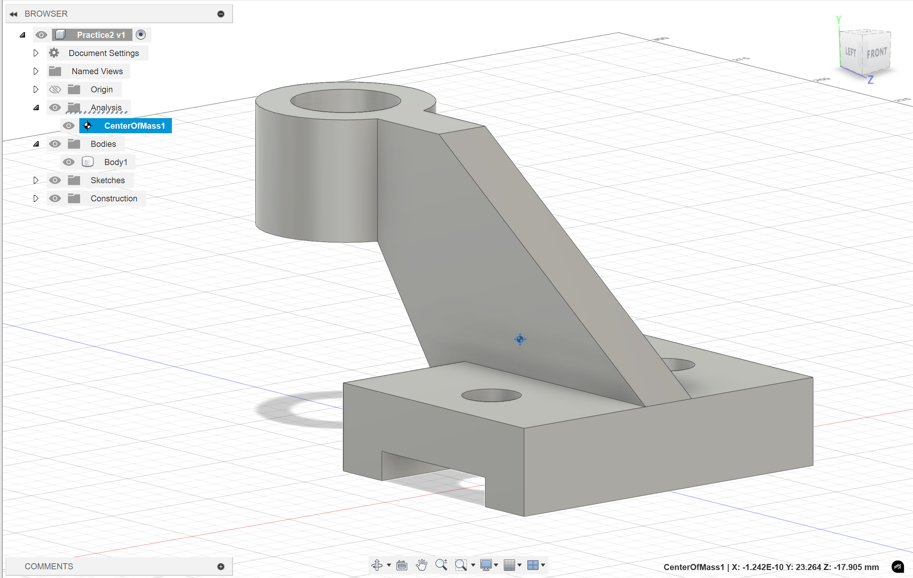
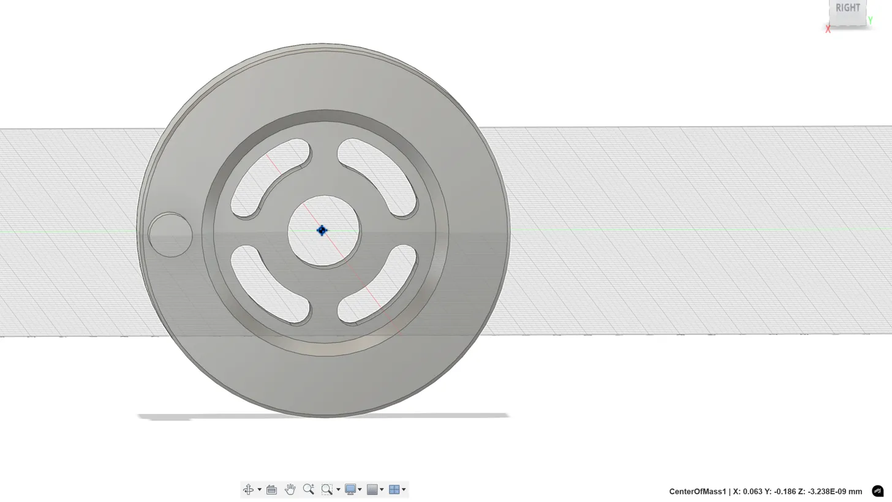

# Measurement

## Distance & Area

The quickest way to measure is to click on the **specific face** of the object. And then fusion 360 will tell you the **surface area / length** of the face / line you select.

<figure><figcaption>
Measurement Example
</figcaption></figure>


Usually we won't use the "Measurement" from the "Inspect" panel


## Volume

This is done by

1. Select Body (from Browser)
2. Right click "**Properties**"

<figure><figcaption>
Volumn Example
</figcaption></figure>

## Center of Mass

This function takes in the input of an **object** and ths coordinates are stored in the "Analysis" folder.

<figure><figcaption>
Center of Mass Example
</figcaption></figure>


Usually, you can get coordinates of the center of mass by using [#volume](measurement.md#volume "mention") method. This method is to show the **center of mass** visually.


## Questions

In the figure below, the distance from the center of mass to the rotational axis (x-axis) is given by

$$
d=\sqrt{y^2+z^2}
$$

<figure><figcaption>
Center of Mass Calculation
</figcaption></figure>

Which is around 0.186 mm.


Another point we can think about is that we can move along the rotational axis (x-axis), so the x-coordinate may change, so we need to calculate using the y-coordinate and z-coordinate.


## Tips

1. What's the difference between the center of mass and center of volumn? **If your part has uniform density, then "center of mass" is the same as "center of volume"**. **Otherwise, thay may not be the same. But in EG1311, since we are not taught about how to change the density, so in this course, "center of mass" is the same as "center of volume" and we use "center of volume" in our question to make it more precise. But we still can use the "center of mass" tool in fusion 360 to solve this kind of question.**
