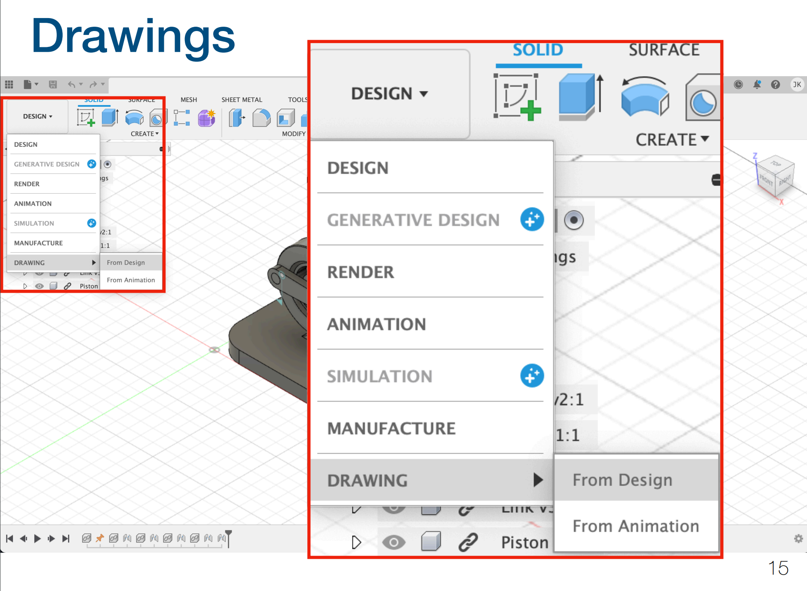
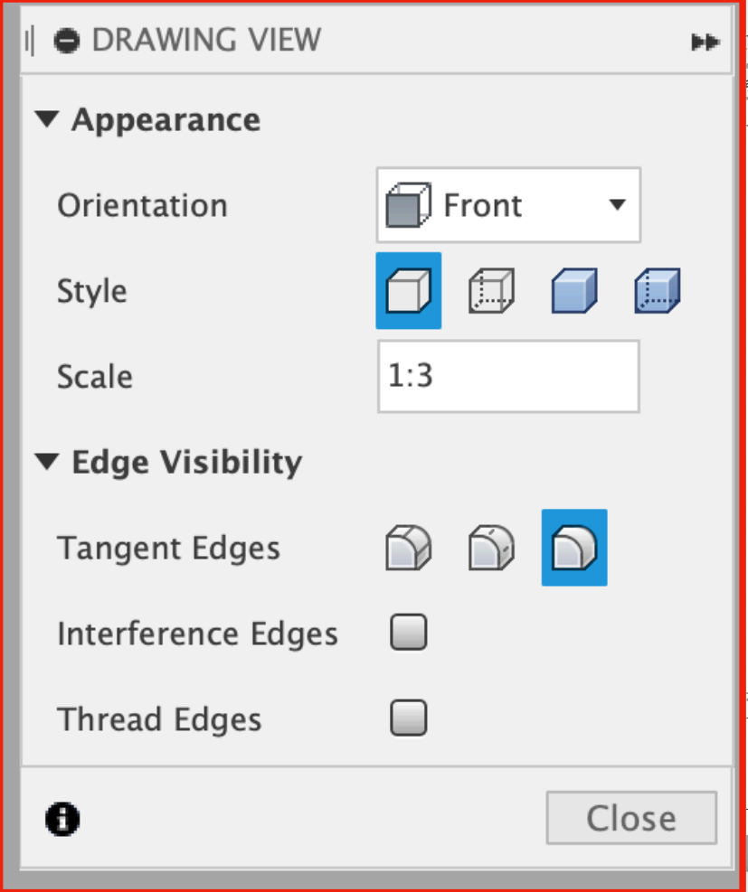

# Animation, Appearance & Drawing

## Motion Study

**Motion Study** in Fusion 360 is a tool used to simulate and analyze the motion of an assembly based on joints, constraints, and forces. It allows you to visualize how different components move and interact over time, providing insights into the behavior of mechanical systems before prototyping.

## Apperance

It is just useful to make your components fancy.

## Drawings

It is created from here.

<figure><figcaption>
Create drawings
</figcaption></figure>

### Drawing Views

<figure><figcaption>
Drawing Views
</figcaption></figure>

In this drawing view, the **scale** controls the size of the part or assembly in the drawing relative to its real-world dimensions.

In this case, the scale is set to **1:3**, meaning the drawing will display the object at one-third of its actual size. Here's how the scale works:

* **1:1** means the drawing is the same size as the real object.
* **1:2** means the object is reduced to half its real size.
* **2:1** would mean the object is shown twice as large as the real object.

You can adjust this scale depending on the available drawing space and the size of the object to ensure the drawing fits appropriately on your sheet while remaining easy to read.


The scale does not affect the actual measurements of the object.

