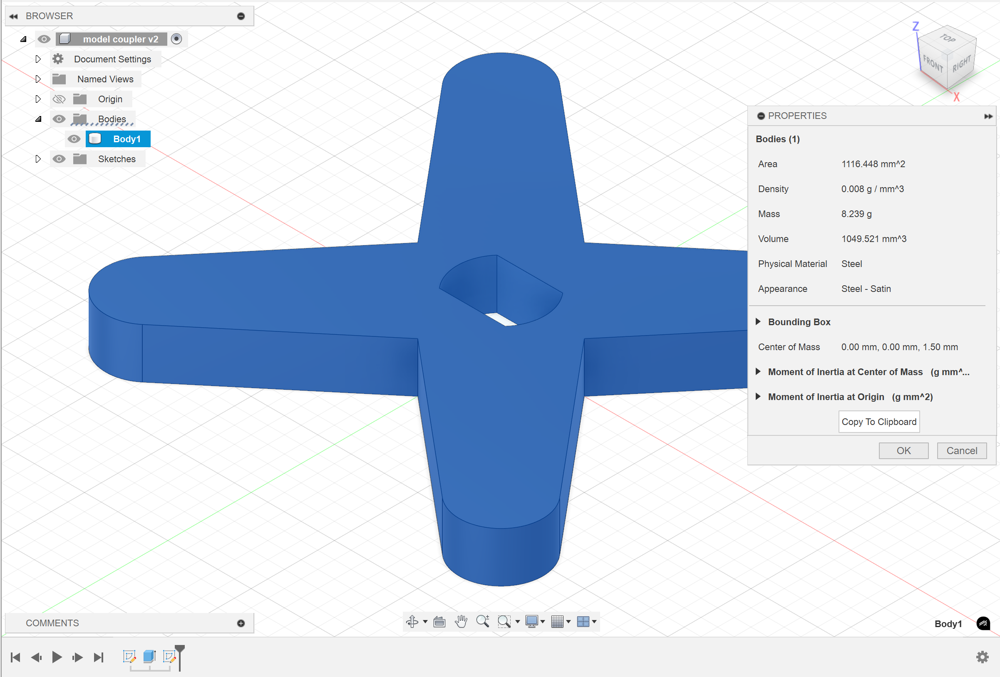
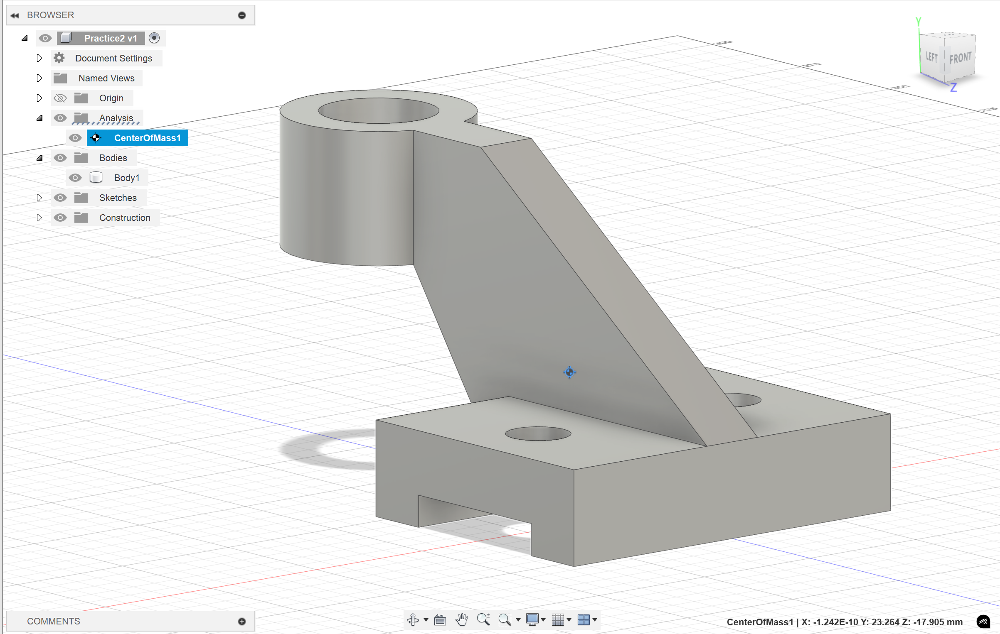

# Measurement

## Distance & Area

The quickest way to measure is to click on the **specific face** of the object. And then fusion 360 will tell you the **surface area / length** of the face / line you select.

<figure><figcaption>
Measurement Example
</figcaption></figure>


Usually we won't use the "Measurement" from the "Inspect" panel


## Volume

This is done by

1. Select Body (from Browser)
2. Right click "**Properties**"

<figure><figcaption>
Volumn Example
</figcaption></figure>

## Center of Mass

This function takes in the input of an **object** and ths coordinates are stored in the "Analysis" folder.

<figure><figcaption>
Center of Mass Example
</figcaption></figure>


Usually, you can get coordinates of the center of mass by using [#volume](measurement.md#volume "mention") method. This method is to show the **center of mass** visually.


