# Project Materials

## Kits

Students may only use the materials provided in the production of their robots. The **three exceptions** to this rule is that students may supplement their robots with

1. paper clips provided by the lab,
2. outside adhesive material (specifically glues or tapes), and
3. paper

No other outside struc- tural mechanical or electrical components should be used. All items must be returned to lab in Tutorial 6, except for items marked with a `(⋆)`.

### Tools Kit

| Tools Kit                 | Qty |
| ------------------------- | --- |
| Universal Battery Charger | 1   |
| 9V Rechargeable Battery   | 2   |
| AA Rechargeable Battery   | 8   |
| Hot Glue Gun              | 1   |
| A4 Cutting Mat            | 1   |
| Retractable Pen Knife     | 1   |
| 30cm Steel Ruler          | 1   |
| Ping Pong Ball            | 1   |

### Materials Kit

| Materials Kit                 | Qty |
| ----------------------------- | --- |
| (⋆) 50cm × 50cm 2mm Cardboard | 1   |
| (⋆) A4 2mm Polypropylene      | 1   |
| (⋆) A4 5mm Foamcore           | 1   |
| (⋆) Anti-slip mat sheet       | 1   |
| (⋆) Roll of masking tape      | 1   |
| (⋆) Popsicle Sticks           | 20  |
| (⋆) 3” diameter rubber bands  | 10  |
| (⋆) Glue Sticks               | 3   |

### Electronics Kit

| Image                                                                                    | Part                                                                                                                                               | Image                                                                                | Part                                                                                                                                     |
| ---------------------------------------------------------------------------------------- | -------------------------------------------------------------------------------------------------------------------------------------------------- | ------------------------------------------------------------------------------------ | ---------------------------------------------------------------------------------------------------------------------------------------- |
| 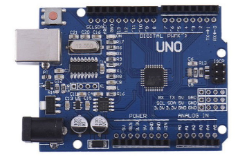                   | 
Arduino Uno

Qty 1 <a href="https://store-usa.arduino.cc/products/arduino-uno-rev3/">Datasheet</a>
                                  | 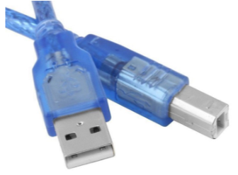             | 
USB Cable

Qty 1

USB-B to USB-A
                                                                                        |
| 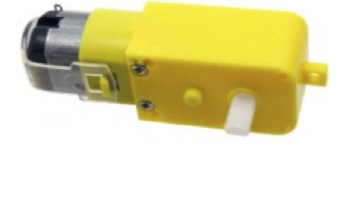                     | 
Geared Motor

Qty 2

120:1 gear ratio

3-9V volts <a href="https://grabcad.com/library/yellow-dc-motor-1">CAD Drawing</a>
 | 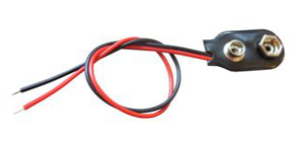     | 9V Battery Holder Qty 1                                                                                                                  |
| 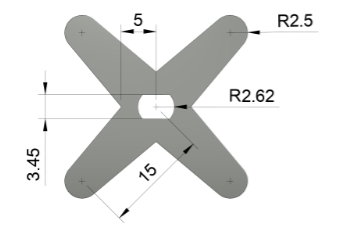                                                | 
Motor Coupler Qty 2
                                                                                                                      | 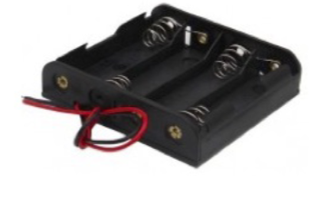    | 
4 x AA Battery Holder

Qty 1
                                                                                                 |
| 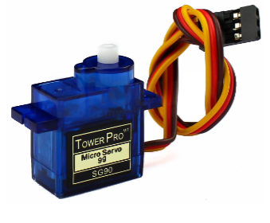               | 
Servo Motor

(SG90)

Qty 1 <a href="http://www.ee.ic.ac.uk/pcheung/teaching/DE1_EE/stores/sg90_datasheet.pdf">Datasheet</a>
    | 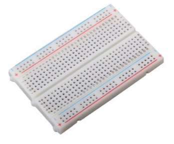            | 
Breadboard 400-Tie-Point

Qty 1 <a href="https://learn.sparkfun.com/tutorials/how-to-use-a-breadboard/all">How to use</a>
 |
| 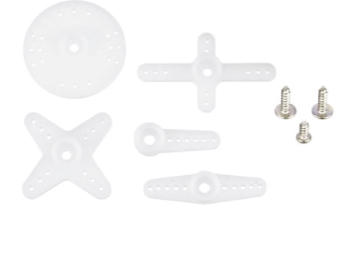 | 
Servo Motor

Coupler Pack

Qty 1
                                                                                                  | 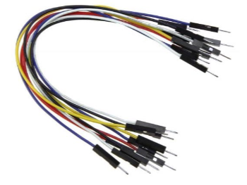          | 
(⋆) 40cm Jumper Wires

Qty 20 Male-Male Qty 10 Male-Female
                                                                   |
| 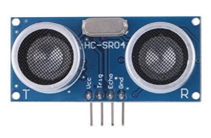         | 
Ultrasonic Sensor (HC-SR04)

Qty 1 <a href="https://cdn.sparkfun.com/datasheets/Sensors/Proximity/HCSR04.pdf">Datasheet</a>
         | 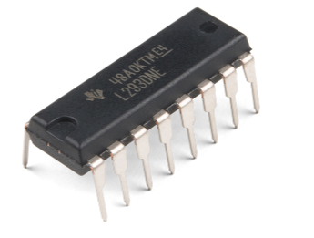 | 
H-Bridge (L293DNE) Motor Driver

Qty 1 <a href="https://www.ti.com/lit/ds/symlink/l293.pdf">Datasheet</a>
                 |

## Laser Cutting

### File name convention

`BXX teamY fileZ printQ.dxf` where:

1. `XX` and `Y` correspond to the student’s section number and team number respectively;
2. `Z` represents the number of files submitted by the team so far (first submission is 1); and
3. `Q` represents the number of prints that should be made of the file.


Note that teams are limited to printing within **one 20cm × 20cm** square **per tutorial session**.

