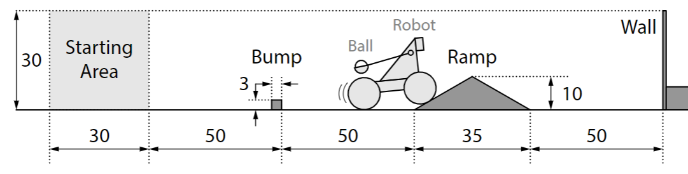
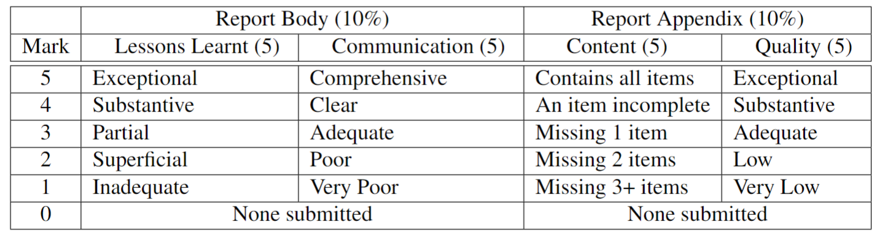
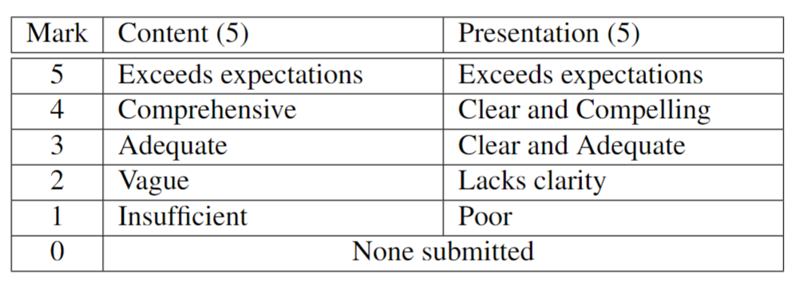

# Rubrics

## Project

<figure><figcaption>
Project Animation
</figcaption></figure>

### Setup Requirements

Each team is tasked with building a self-powered robot that:

* navigates an obstacle course consisting of a starting area, a bump, a ramp, and a wall, and
* delivers a ping pong ball over the wall.

The robot must be designed to meet the following specifications:

* The robot must fit within a 30 × 30 × 30 cm cubic at start.
* The robot must carry one 9V battery and four AA batteries (no more or less).
* The robot must be made using only the materials provided.
* The team may not interact with the robot after it leaves the starting area.
* The team may not attach anything to the ping pong ball.
* The robot has up to 30 seconds to complete the course.

### Graded Requirements

In Tutorial 5, you will be allowed **at most three graded runs** on the course which must be observed by your Tutor. Your team’s score on the Obstacle Checkoff will be **the maximum score** of your three graded runs. The score for a graded run is an integer between 0 and 10 corresponding to the sum of the following rubric items that are true during the run:

| Base Pts | Rubric Item                                              |
| :------: | -------------------------------------------------------- |
|    +1    | All of the robot passes the bump                         |
|    +1    | All of the robot passes the ramp                         |
|    +1    | Part of the robot reaches within 5 cm of the wall        |
|    +1    | No part of the robot touches the wall                    |
|    +1    | Robot is in contact with the ball after passing the ramp |
|    +1    | Ball leaves contact with robot after passing the ramp    |
|    +1    | Ball goes over the wall                                  |

| Weight Pts | Rubric Item                                                                          |
| :--------: | ------------------------------------------------------------------------------------ |
|     +1     | Robot is not the heaviest among robots in the same section scoring all 7 base points |
|     +1     | Robot is the lightest among robots in the same section scoring all 7 base points     |

| Extra Pt | Rubric Item                                                               |
| :------: | ------------------------------------------------------------------------- |
|    +1    | After scoring all 7 base points, all of the robot returns behind the bump |

## Report

Each team is required to submit a team report containing a body and appendix. The **body** of the report is a description of lessons learnt during the project design process, describing any difficulties and how they were overcome. The body should be no more than **5 pages, 12pt Times New Roman, single spaced**, excluding title page, contents, and appendix. The **appendix** should contain the following information (no page limit, but your Tutor may not be happy if its length is excessive).

1. A photograph of the final physical robot.
2. A CAD rendering of a model for the complete final robot.
3. An image of a TinkerCAD diagram corresponding to the circuitry of the final design.
4. The Arduino source code deployed on the final design.
5. A fully-dimensioned 2D CAD drawing for each structural component made from sheet material used in the final design, depicting how it was cut. For each part, include the material used (acrylic, cardboard, polypropylene, foam core, or paper).

While the purpose of the report body is to describe the journey and lessons learnt during the design process, the purpose of the report appendix is to provide documentation that would be necessary to reproduce your team’s final design and results. The body and appendix are weighted equally in as- sessing the report. Rebruics for how these components will be graded are provided below.

<figure><figcaption>
Rubrics for report body and appendix
</figcaption></figure>

## Video

Each team is required to submit a team video to clearly communicate their final project. Your video will be shown to the rest of your section during Tutorial 6. There will be a brief Q\&A following each video so that the other students in your section can ask your team questions (your team will be required to answer at least one question). The video should contain:

1. the names of your team members, and your section and team numbers;
2. documentation of your team’s brainstorming, selection, and prototyping process;
3. discussion of design choices made that differentiate your robot from other teams;
4. at least 1 difficulty that was overcome; and
5. video of the final robot on the obstacle course (the video may be shown faster than real time).

The video should be no longer than 5 minutes. And the grading rubrics is below

<figure><figcaption>
Video Grading Rubrics
</figcaption></figure>
